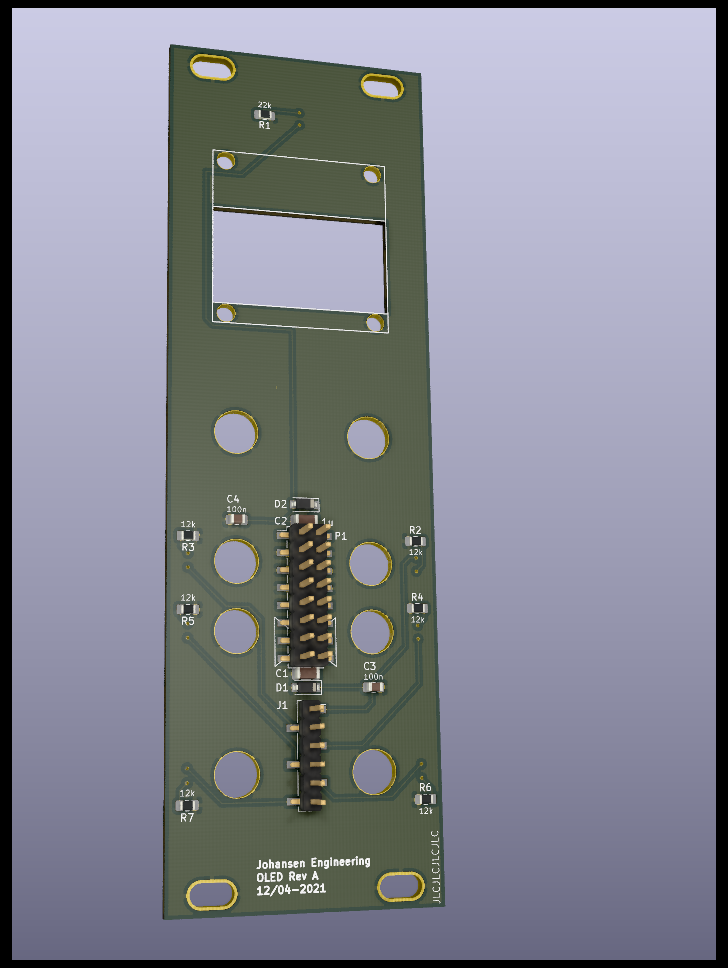

# KicadJE_OLED_Face
Faceplate for uP that uses I2C SSD1306
# Purpose
Faceplate for uProcessor controlled eurorack units with an SSD1306 OLED display, two rotary dials/pots, two audio inputs, two cv inputs and two outputs.
## Board 1
Adjustment:

Gate Input

CV Input

Input Audio 

Output Audio  

# Status - Received
## Initial 
| Stage  | Detail | Status |
| ------------- | ------------- | ------------- |
| create material  | sch |OK
| | pcb |OK
| | gerber |OK
| production |  |  
|  | produced  |OK 
|  | delivered |OK
## Preliminary validation
| Test  | Detail | Status |
| ------------- | ------------- | ------------- |
| Initial Inspection | | ok |
| Mechanical Inspection | | ok - does not match I/O and controls with earlier boards|
| Initial Technical Test | Board 1 |  |
| Initial Product Test | Board1 |  |

## Secondary validation
| Test  | Detail | Status |
| ------------- | ------------- |------------- |
| Product Test | 1 | |
| Quality | 1 | |
| Long Term Product Test |  |  |
| Power Draw |  | 

## Errata
### Errata - 

## Issues and Notes
### 

# Pictures

# Schematic
## Sch 1

# Analysis
## Diag 1

## Prototype

